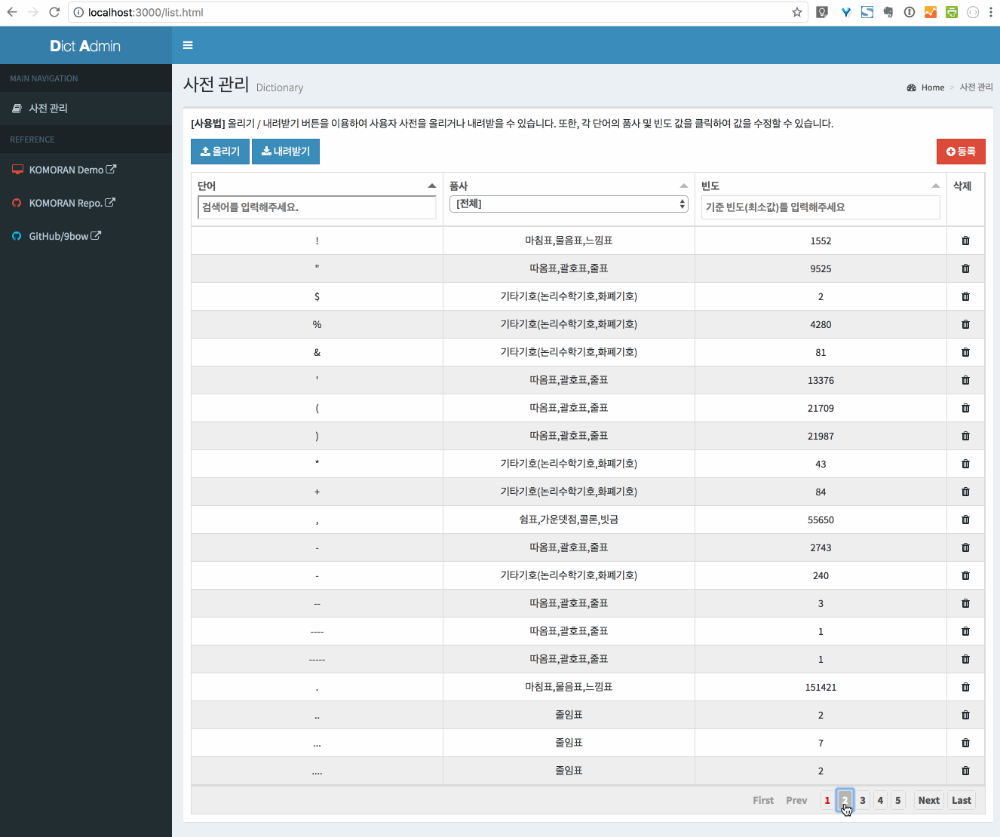

## 개요
DictAdmin은 [한국어 형태소 분석기 KOMORAN](https://github.com/shin285/KOMORAN)의 사용자 사전을 관리하는 도구입니다.

* *주요 기능 설명 - TBD*

## 사용법
### 환경
* node.js 8.11.3 이상
* Chrome Browser

### 설치
* Git을 이용하여 DictAdmin 저장소를 복제합니다.
  ```sh
    git clone https://github.com/9bow/DictAdmin
    cd DictAdmin
  ```
    * 또는, [다음 링크](https://github.com/9bow/DictAdmin/releases)에서 소스 코드를 내려받은 후 압축을 풉니다.
* 필요한 모듈을 설치합니다.
  ```sh
    npm install
  ```
* `bin/www`을 실행합니다.
  ```sh
    node ./bin/www
  ```
* Chrome Browser를 열고 [http://localhost:3000](http://localhost:3000) 에 접속합니다.

### 사용법
*TBD*

### 알려진 문제
* 문제. `FATAL ERROR: Ineffective mark-compacts near heap limit Allocation failed - JavaScript heap out of memory` 오류가 발생하며 실행을 멈춥니다.
* 해결. 이 문제는 주로 사전 파일의 크기가 클 때 발생합니다. 다음의 명령어로 다시 구동해보세요.
    ```sh
      node --max-old-space-size=4096 ./bin/www
    ```

## TODO
* [ ] 새로운 Item 추가 기능
* [x] 사전 파일(`.word`) 업로드 기능
  * [ ] 임시 디렉토리(`./temp`) 내 파일 삭제
  * [ ] 파일 업로드 기능 테스트
* [ ] 포함된 CSS/JS 라이브러리들의 LICESNE 추가